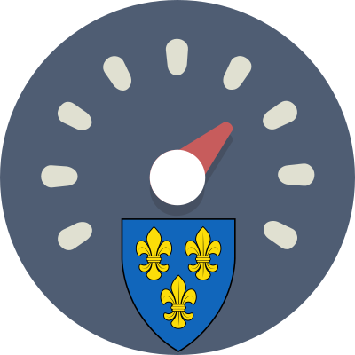

# WiesbadenRaserBot

This is a Twitter bot that runs on the [n8n](https://n8n.io) platform.
The bot reports speeding violations of vehicles in [Wiesbaden, Germany](https://en.wikipedia.org/wiki/Wiesbaden).
Reported speeds are based on the data requested from the [HERE Traffic API](https://developer.here.com/documentation/traffic/dev_guide/topics/what-is.html).

## How it works
Basically, the bot consists of a three-step process:
1) First, so-called `Traffic Flow data` for the area of Wiesbaden is requested from the HERE Traffic API.
2) Subsequently, the data is validated, filtered and mapped (road names, speed limits etc.) based on local conditions.
3) Finally, any speeds exceeding the speed limit (plus a 10 % margin) are posted to [Twitter](https://twitter.com/WiesbadenRaser).

## Set up your own bot

tbd

## Links and acknowledgements
* Original idea and alternative setup by [@BerkshireCar](https://twitter.com/BerkshireCar) ([GitHub-Repository](https://github.com/BerkshireCar/SpeederBot))
